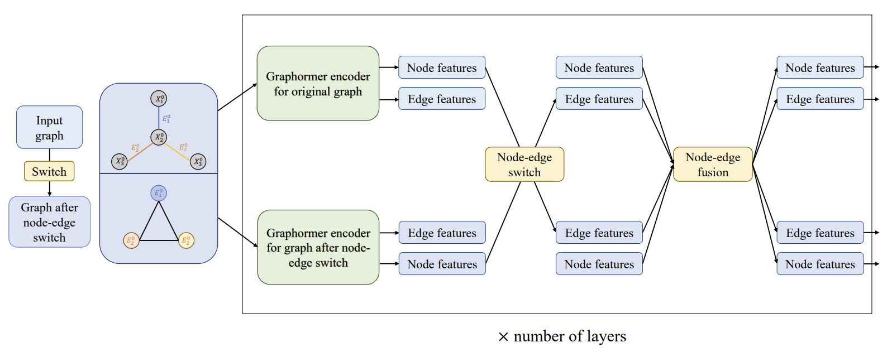

# DualGraphormer: towards better molecular properties prediction by leveraging edge features for node-edge fusion and switch

## Course project of CPSC 483 01 (FA23): Deep Learning on Graph-Structured Data

In the evolving landscape of graph deep learning, the prediction of molecular properties remains a pivotal challenge. Though many graph transformers have demonstrated a relatively good performance on molecular property prediction, they still suffer from inadequate encoding of edge features and lack of an efficient way to update node features by incorporating edge features. And on small dataset, graph transformer without pretraining on large dataset would have a very poor performance. In this paper, we introduce DualGraphormer, a novel architecture that significantly enhances molecular properties prediction by innovatively leveraging edge features for node-edge fusion and switch mechanisms. Our approach uniquely combines the strengths of transformer models with graph neural networks, simultaneously update node and edge features, and integrating them together to better represent the graph features. We evaluate our model on the ogb-molhiv dataset, and prove that our model has outperformed graphormer when not pretrained on large-scale datasets.



# Usage

The input form is the "Data" in pytorch_geometry:

Take ogb-molhiv as an example:

```python
import torch
import ogb
import pandas as pd
from ogb.graphproppred import PygGraphPropPredDataset
from torch_geometric.data import DataLoader

from model import DualGraphormer,Unbalanced_BCE_logits_loss
from lr import PolynomialDecayLR

if __name__=="__main__":
    epochs = 12
    batch_size = 128
    peak_lr = 2e-4
    end_lr = 1e-9
    total_updates = 33000 * epochs / batch_size
    warmup_updates = total_updates // 10

    torch.manual_seed(114514)

    dataset = PygGraphPropPredDataset(name="ogbg-molhiv", root='../../dataset/')
    split_idx = dataset.get_idx_split()
    train_loader = DataLoader(dataset[split_idx["train"]], batch_size=batch_size, shuffle=True)
    val_loader = DataLoader(dataset[split_idx["valid"]], batch_size=batch_size, shuffle=False)
    test_loader = DataLoader(dataset[split_idx["test"]], batch_size=batch_size, shuffle=False)

    print("train loader length:",len(train_loader))
    print("val loader length:", len(val_loader))
    print("test loader length:", len(test_loader))

    my_model=DualGraphormer(
        hidden_size=512,
        ffn_size=512,
        dropout_rate=0.1,
        attention_dropout_rate=0.1,
        num_heads=32,
        num_classes=1,
        input_dropout_rate=0,
        n_layers=6,
        num_hops=5,
        dataset_name="ogbg-molhiv",
    ).cuda()

    optimizer = torch.optim.AdamW(my_model.parameters(), lr=peak_lr, betas=(0.99, 0.999))
    scheduler = PolynomialDecayLR(
        optimizer=optimizer,
        warmup_updates=warmup_updates,
        tot_updates=total_updates,
        lr=peak_lr,
        end_lr=end_lr,
        power=1
    )

    loss_func=Unbalanced_BCE_logits_loss().cuda()
    evaluator=ogb.graphproppred.Evaluator('ogbg-molhiv')

    records=[]
    for epochi in range(epochs):
        my_model.train()
        loss_train=0
        y_preds_train=[]
        y_train=[]
        train_roc=0
        for (stepi, x) in enumerate(train_loader, start=1):
            y_pred = my_model(x)
            y = x.y.to(torch.float32).cuda()
            lossi=loss_func(y_pred,y)
            lossi.backward()
            optimizer.step()
            optimizer.zero_grad()
            scheduler.step()
```

# Requirements

Please refer to requirements.txt

# Reproductivity

Simply run `train_normlr.py` to reproduce the results. Raw results are presented in `1_normlr.out`. The results for model comparison is in `my_GRIT.zip` and `graphormer.zip`.

The introduction of the model is in `Dualgraphormer.pdf`, cite after use.

